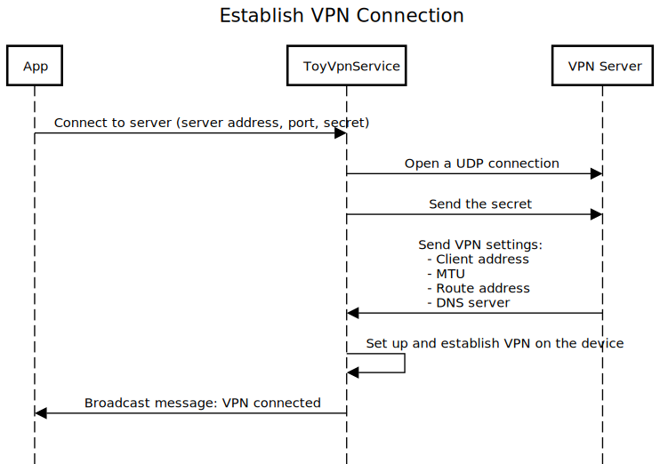
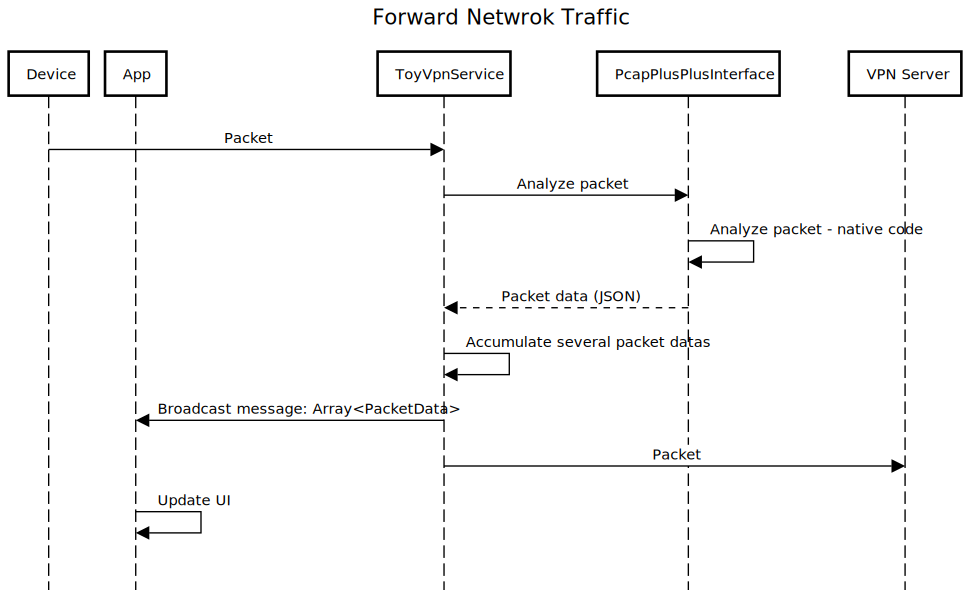
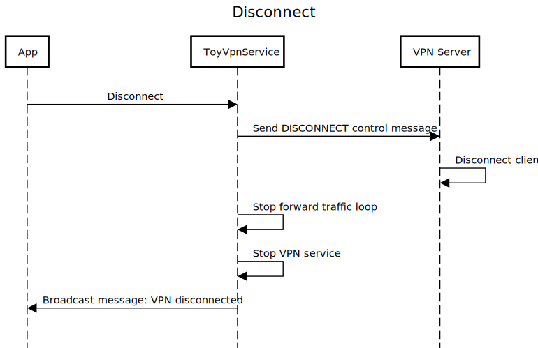

<div align="center">


[](https://github.com/seladb/ToyVpn-PcapPlusPlus/actions/workflows/builtAndTest.yml)

</div>

## Table of Contents

- [Overview](#overview-️)
- [Features](#features-)
- [Using the App](#using-the-app-)
- [Build and run instructions](#build-and-run-instructions-)
- [Technical Details](#technical-details-)
    - [Main Components](#main-components-)
    - [Application Flows](#application-flows-)
- [License](#license-)

## Overview 🛠️

ToyVPN PcapPlusPlus is an Android application designed for monitoring and analyzing network traffic on an Android device.
It achieves this by establishing a VPN tunnel and routing all network traffic through it. This method provides access to raw packets, 
enabling real-time analysis and data storage.

Use Cases:
- **Monitoring**: Track network traffic on an Android device.
- **Testing**: Analyze network interactions of an app during development and debugging.
- **Learning**: Example implementation of:
  - Android's VPN service and APIs
  - Using PcapPlusPlus in an Android app

This project is inspired by and built upon [Android's ToyVpn Example](https://android.googlesource.com/platform/development/+/master/samples/ToyVpn),
a sample application by Google that demonstrates Android APIs for creating VPN solutions.

Unlike Android's ToyVpn, this project is built with modern Android technologies such as:
- **Kotlin** which the official programming language for Android
- **Jetpack Compose** for UI design
- **Newer Android API versions**
- **MVVM** (Model-View-ViewModel) architecture

## Features 🚀

- VPN client app with a built-in VPN service.
- VPN server capable of handling multiple clients simultaneously.
- Real-time network traffic monitoring and analysis of the following protocols: IPv4/6, TCP, UDP, DNS, and TLS.
- Storage of network traffic per client in **pcapng** files.

## Using the app 📲

ToyVPN consists of two components:
- **The Android app** (VPN client)
- **The VPN server** (acts as a gateway to the internet)

The app connects to the server which in turn connects to the internet.
In order to run the app you need to first build and run the server which needs to run on
a separate Linux machine (see instructions [here](server/README.md#building-the-project-️)).
Then you can run the app

https://github.com/user-attachments/assets/82a2b9b1-85b5-420e-aa88-88ef54bdc77f

The app connects to the VPN server, which then routes traffic to the internet. To use the app:
1. **Set up the VPN server** on a separate Linux machine (see [server setup instructions](server/README.md#building-the-project-️)).
2. **Launch the app** and grant necessary permissions upon first use (click "Ok" if you see the "Connection Request" modal).
3. **Enter the server details** (IP address, port, and the secret used when running the server).
4. **Establish a connection:**
   - If successful, all network traffic is routed through the VPN service.
   - The app displays live traffic statistics, including packet counts per protocol, TCP/UDP connections, DNS requests,
   - and TLS hostnames.
5. **Monitor the connection:**
   - The assigned internal IP address will be displayed.
   - If packet capture is enabled, traffic data is stored on the VPN server in `.pcapng` format.
     The file name will be: `Internal IP address with dashes instead of dots.pcapng`,
     for example: `10-0-0-1.pcapng`
6. **Disconnect from the VPN** by scrolling down and tapping the "Disconnect" button.

## Build and run instructions 🏗️

Please follow the steps below to get a working version of the app:

### Step 0: Clone with submodules
Ensure you clone the repository with submodules to include necessary dependencies:
```shell
git clone --recurse-submodules https://github.com/seladb/ToyVpn-PcapPlusPlus
```

### Step 1: Download PcapPlusPlus pre-compiled libraries for Android
- Download the latest PcapPlusPlus release for Android from: [PcapPlusPlus Releases](https://github.com/seladb/PcapPlusPlus/releases).
- Extract the archive (usually `pcapplusplus-v*.*-android.tar.gz`).
- Rename the extracted folder to `pcapplusplus` and place it under `ToyVpn-PcapPlusPlus/app/libs`.
- Alternatively, you can build PcapPlusPlus for Android following [these instructions](https://pcapplusplus.github.io/docs/install/android).

### Step 2: Build and run the server

Follow the instructions in the [server README](server/README.md#building-the-project-️) to set up the VPN server.

### Step 3: Build and run the app
Once the server is running, you can build and run the Android app:

Using Android Studio:
- Open the project in Android Studio.
- Select the target device and click Run.

Using the Command Line:
```shell
chmod +x gradlew
./gradlew assembleDebug
```

## Technical details 🔍

This section covers the internal architecture, components, and flows of the application.

Like most Android apps, this app mostly follows the **MVVM (Model-View-ViewModel)** architecture which keeps a separation
between the UI components and the business logic.


### Main Components 📦

UI components:

- **`ConnectScreen`**: The UI screen responsible for validating user server input. Once the user clicks "Connect," it calls
  the view-model to establish the VPN connection and then monitors its status, redirecting the user to the `StatsScreen`
  if successful or displaying an error message otherwise. 
- `StatsScreen`: The UI screen responsible for displaying real-time network statistics, including total packet counts,
  protocol distribution, TCP/UDP connections, DNS requests, and TLS hostnames. It continuously updates based on data received
  from the view-model, which processes data from the `ToyVpnService`. The screen reacts to changes in the view-model state to
  reflect the latest network statistics and connection status.

Model and View-Model:
 
- **`ToyVpnViewModel`**: The view-model of the app, responsible for keeping the connection state, processing network traffic data,
  and interacting with the `ToyVpnServiceManager`. It receives and processes packet data, and calculates protocol distribution.
- **`ToVpnServiceManager`**:  A proxy class for interacting with `ToyVpnService`. It is primarily using broadcast messages
  to send instructions and receive updates regarding connection status and packet data from the VPN service.

VPN service:

- **`ToyVpnService`**: A custom service that extends Android's `VpnService`. It is responsible for establishing a VPN connection
  between the device and the VPN server. Here's a breakdown of its key responsibilities:
  1. **VPN Tunnel Setup**: The service creates a VPN tunnel and routes all device traffic through it to the connected VPN server.
  2. **Traffic Forwarding**: Once the VPN tunnel is established, the service forwards the network traffic between the device
     and the server. This includes both inbound and outbound data.
  3. **Statistics Update**: It processes data from `PcapPlusPlusInterface`, such as packet counts, connection status, and
     protocol distribution. These statistics are then broadcast to the app's UI to keep it updated in real-time.

PcapPlusPlus interface and JNI/native components:

- **`PcapPlusPlusInterface`**: Is the wrapper class which initializes and runs JNI/native code, written in C++, that uses
  PcapPlusPlus to analyze each packet coming either from the device or from the server. It analyzes certain protocols
  as well as TCP/UDP connection information and more granular data on certain protocol such as DNS and TLS. It then formats
  the analysis in a JSON structure and sends it back to the `ToyVpnService` which in turn sends it back to the app.

### Application Flows 🔄

The following diagrams illustrate the core workflows of the app:







## License 📜
This project is licensed under the **MIT License**.
