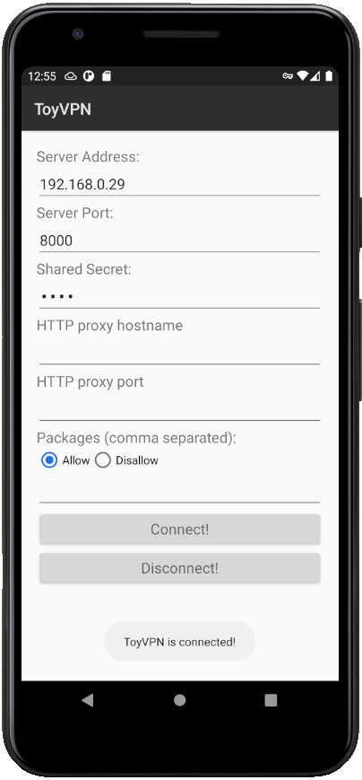
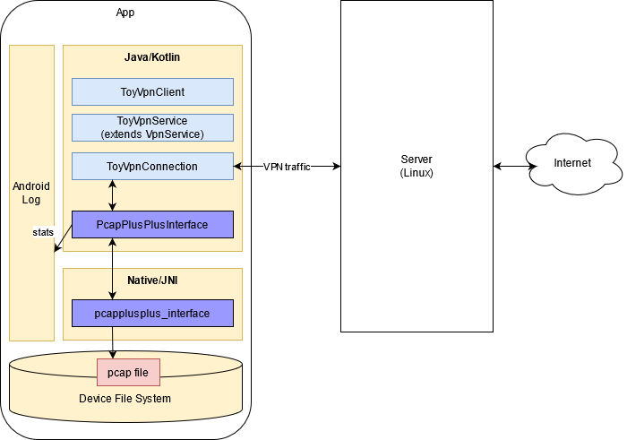

# ToyVpn-PcapPlusPlus

This project demonstrates how PcapPlusPlus can be used in Android apps.
It is built on top of [Android's ToyVpn Example](https://android.googlesource.com/platform/development/+/master/samples/ToyVpn) and adds a layer of network traffic analysis for the packets processed by ToyVPN.

## Table Of Contents

- [ToyVpn](#toyvpn)
- [ToyVpn & PcapPlusPlus](#ToyVpn-&-PcapPlusPlus)
- [Build and run](#build-and-run-instructions)
- [Technical details](#technical-details)

## ToyVpn

[ToyVpn](https://android.googlesource.com/platform/development/+/master/samples/ToyVpn) is an Android example app provided by Google that demonstrates Android APIs to create VPN solutions. You can read more about it in the [Android documentation](https://developer.android.com/guide/topics/connectivity/vpn).

ToyVpn uses [`VpnService`](https://developer.android.com/reference/android/net/VpnService) to handle incoming and outgoing network traffic, which means is has access to all of the network packets going through the VPN (which is otherwise not possible on non-rooted devices). This makes it a great example of how PcapPlusPlus can be used in Android apps and run on any device without special requirements such as a rooted device.

## ToyVpn & PcapPlusPlus

__ToyVpn-PcapPlusPlus__ is a version of ToyVpn that uses PcapPlusplus to gather data and metrics on the network traffic that goes through the VPN. It collects data such as packet count of different protocols (IPv4, IPv6, DNS, TLS, etc.), TCP connections, DNS requests and responses, TLS versions, TLS Server Name Indication (SNI), and more. These metrics are collected and written to the app's log. In addition to data collection, all of the network traffic is captured and saved to a pcap file that can be used for further investigation.

Here is a screenshot of the app which is similar to ToyVpn's original UI, nothing was changed on that front:



And here is an example of the metrics collected by the app (as written to the app's log):

```shell
03-19 00:57:33.076  6085  6130 I PcapPlusPlusInterface: Packet stats:
03-19 00:57:33.076  6085  6130 I PcapPlusPlusInterface: Packets=2639
03-19 00:57:33.076  6085  6130 I PcapPlusPlusInterface: IPv4=2620
03-19 00:57:33.076  6085  6130 I PcapPlusPlusInterface: IPv6=11
03-19 00:57:33.076  6085  6130 I PcapPlusPlusInterface: TCP=2583
03-19 00:57:33.076  6085  6130 I PcapPlusPlusInterface: UDP=37
03-19 00:57:33.076  6085  6130 I PcapPlusPlusInterface: Connections=48
03-19 00:57:33.076  6085  6130 I PcapPlusPlusInterface: DNS_req=18
03-19 00:57:33.076  6085  6130 I PcapPlusPlusInterface: DNS_res=19
03-19 00:57:33.076  6085  6130 I PcapPlusPlusInterface: Top_TLS_Version=[(TLS 1.3, 27)]
03-19 00:57:33.076  6085  6130 I PcapPlusPlusInterface: TOP_SNI=[(i.ytimg.com, 4), (cdn.ampproject.org, 4), (lh5.googleusercontent.com, 2), (google.com, 2), (googleads.g.doubleclick.net, 2)]
```

## Build and run instructions

Please follow the steps below to get a working version of the app:

### Step 0: Clone with submodules
When you clone this project from GitHub please make sure to clone it with submodules:
```shell
git clone --recurse-submodules https://github.com/seladb/ToyVpn-PcapPlusPlus
```

### Step 1: Build PcapPlusPlus for Android
- Prerequisites:
  - These steps should run on a Linux machine
  - Make sure you have [Android NDK](https://developer.android.com/ndk) installed
- Clone the PcapPlusPlus repo to some location on your machine: `git clone https://github.com/seladb/PcapPlusPlus /my/path/`
- Use the `build_pcapplusplus.sh` script to build PcapPlusPlus. This script has the following mandatory arguments:
    ```shell
    seladb@ubunu2004:~/ToyVpn-PcapPlusPlus$ ./build_pcapplusplus.sh -h
    
    Help documentation for build_pcapplusplus.sh.
    
    
    Basic usage: build_pcapplusplus.sh [-h] [--ndk-path] [--pcapplusplus-path] [--target]
    
    The following switches are recognized:
    --ndk-path             --The path of Android NDK, for example: '/opt/Android/Sdk/ndk/22.0.7026061'
    --pcapplusplus-path    --The path of PcapPlusPlus source code
    --target               --Build for specific target, should be one of: arm64-v8a, armeabi-v7a, x86, x86_64
    --help|-h              --Displays this help message and exits. No further actions are performed
    ```

- Set `--ndk-path` to your Android NDK path
- Set `--pcapplusplus-path` to the path where you cloned PcapPlusPlus
- The `--target` is not mandatory. Use it only if you want to build PcapPlusPlus for a specific target
- The script takes a few minutes to run and will build PcapPlusPlus libraries for API version 29 on all 4 targets (`arm64-v8a`, `armeabi-v7a`, `x86`, `x86_64`)
- The libraries and PcapPlusPlus header files will be copied to this location: `app/libs/pcapplusplus`

__TBD__: in the next release of PcapPlusPlus Android will be officially supported so you'll be able to take the pre-compiled libraries directly from PcapPlusPlus release page instead of building them yourself

### Step 2: Build and run the server
ToyVpn has 2 parts:
- The Android app
- The server which serves as a simple VPN gateway

The app connects to the server which in turn connects to the outside world.
In order to run the app you need to first build and run the server:
- The server needs to run on a Linux machine
- Go to `server/linux`
- Build the server by running `make`
- As mentioned in [ToyVpnServer.cpp](https://github.com/seladb/ToyVpn-PcapPlusPlus/blob/master/server/linux/ToyVpnServer.cpp) Before you run the server you need to set up a TUN device:
    ```
    # Enable IP forwarding
    echo 1 > /proc/sys/net/ipv4/ip_forward

    # Pick a range of private addresses and perform NAT over eth0.
    iptables -t nat -A POSTROUTING -s 10.0.0.0/8 -o eth0 -j MASQUERADE

    # Create a TUN interface.
    ip tuntap add dev tun0 mode tun

    # Set the addresses and bring up the interface.
    ifconfig tun0 10.0.0.1 dstaddr 10.0.0.2 up  
    ```
- Now you can run the server:
    ```shell
    ./ToyVpnServer tun0 8000 test -m 1400 -a 10.0.0.2 32 -d 8.8.8.8 -r 0.0.0.0 0
    ```

### Step 3: Build and run the app
Now you're ready to build the app:

```shell
chmod +x gradlew
./gradlew assembleDebug
```

## Technical details

In this section we'll go over some technical details around how the app works and the changes that were made to use PcapPlusPlus for collecting network traffic metrics.

We won't cover the details of how VPN is supported in Android because there is very good documentation in the [Android web-site](https://developer.android.com/guide/topics/connectivity/vpn).

Instead, let's talk about the different parts of the app:



TBD